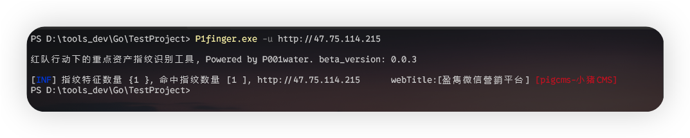
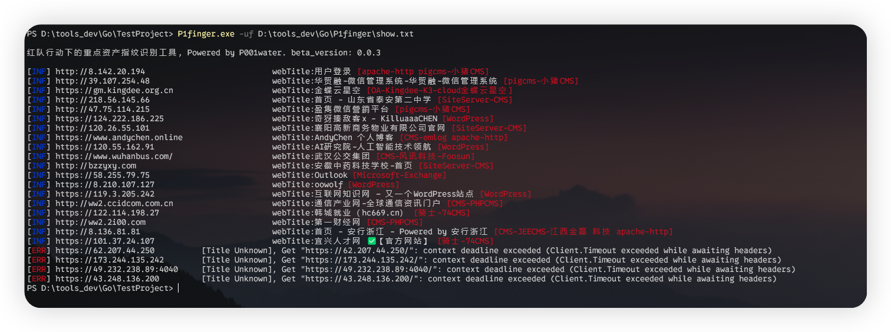
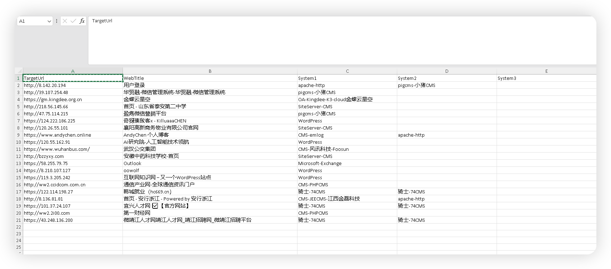

<h3 align="center">P1finger 红队行动下的重点资产指纹识别工具</h3>


---

1.  单个目标探测

```
P1finger -u [target]
```



2. 多目标探测

```
P1finger -uf [target file] //-uf 指定url文件
```



3. 输出到 Excel 表格文件

```
P1finger -uf [target file] -o //-o 参数输出到文件
```



3.  指定指纹目录

默认只读取指定目录下 .yaml后缀的文件

```
P1finger.exe -uf D:\tools_dev\Go\P1finger\urls.txt -fd D:/tools_dev/Go/P1finger
```

4. socks5 代理

```
P1finger.exe -uf D:\tools_dev\Go\P1finger\show.txt -socks 127.0.0.1:4781
```

5. http 代理

```
P1finger.exe -uf D:\tools_dev\Go\P1finger\show.txt -httpproxy 127.0.0.1:4781
```


# Issues 规范

[一款红队重点资产指纹识别工具 - P1finger.exe (qq.com)](https://mp.weixin.qq.com/s?__biz=MzkwNjY0MzIyNw==&mid=2247483705&idx=1&sn=9205adf34b53b9f9c8f09c99e246c44e&chksm=c0e4134df7939a5b5b58399bdf6e3d591fa51968a6e350c5930f2dfee3f600b34d6ba7444c9e#rd)

由于工具还在测试阶段，欢迎提出问题 , issues 标题建议如下

[指纹未识别] [未识别系统名]

> eg. [指纹未识别] [ phpcms ]

[指纹误报] [未识别系统名]

> [指纹误报] [xxx-OA]

[软件bug] [bug类型]

> eg. [软件bug] [报错xxx]


