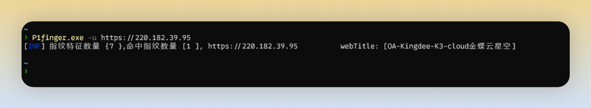
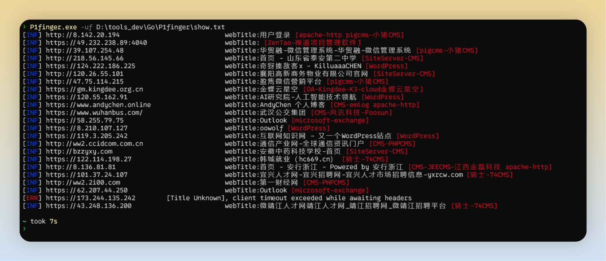

<h3 align="center">P1finger 红队行动下的重点资产指纹识别工具</h3>


---

1.  单个目标探测

```
P1finger -u [target]
```



2. 多目标探测

```
P1finger -uf [target file]
```




3. socks5 代理

```
P1finger.exe -uf D:\tools_dev\Go\P1finger\show.txt -socks 127.0.0.1:4781
```


4. http 代理

```
P1finger.exe -uf D:\tools_dev\Go\P1finger\show.txt -httpproxy 127.0.0.1:4781
```


# Issues 规范

issues 标题建议如下

[指纹未识别] [未识别系统名]

> eg. [指纹未识别] [ phpcms ]

[指纹误报] [未识别系统名]

> [指纹误报] [xxx-OA]

[软件bug] [bug类型]

> eg. [软件bug] [报错xxx]

